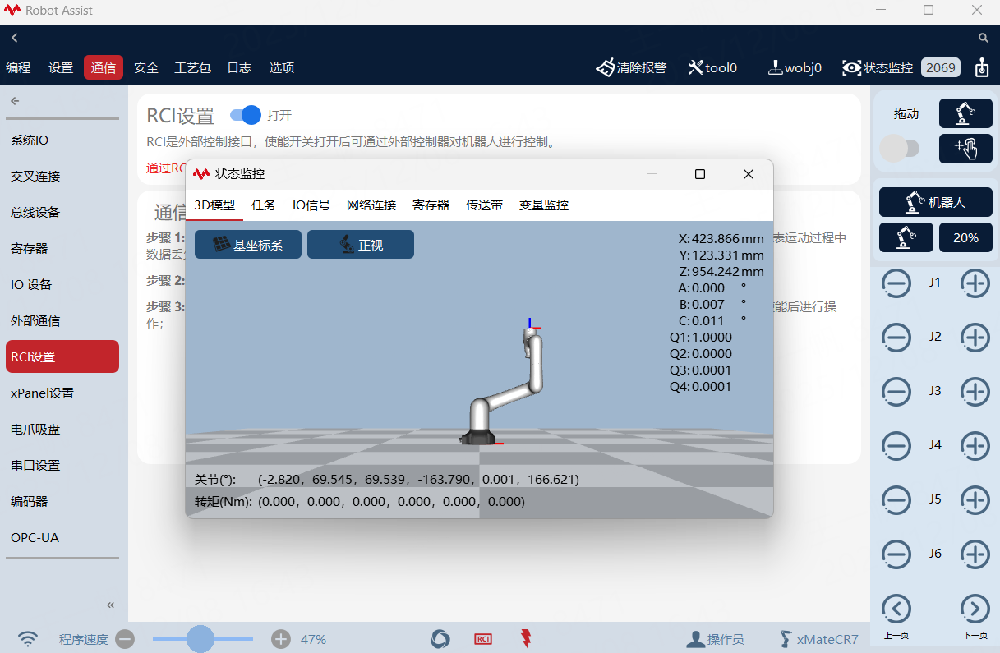
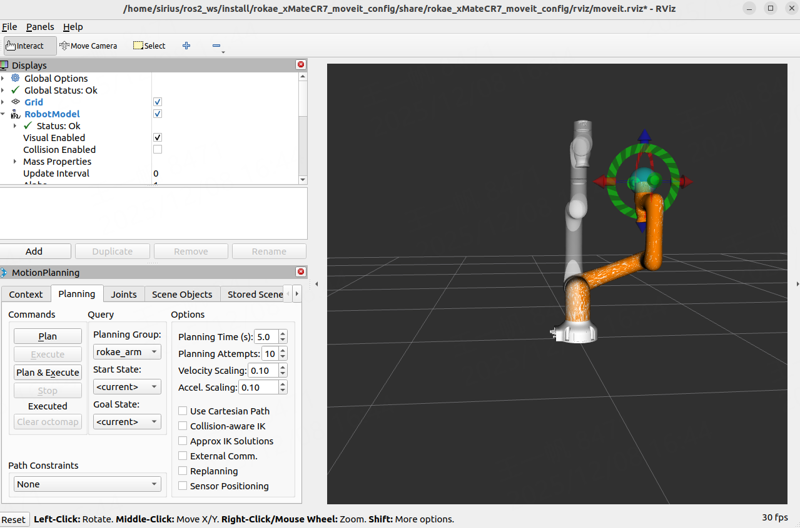
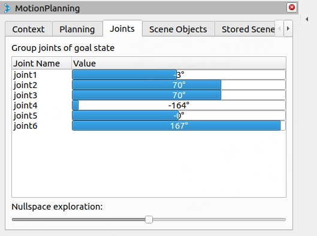
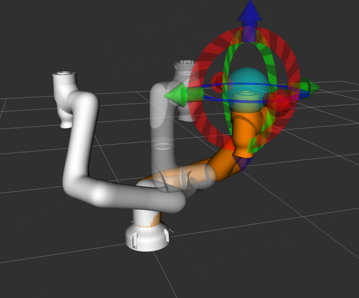

# Rokae  ROS2说明手册

## 介绍

### ROS2简介

ROS2（Robot Operating System 2）是机器人操作系统（ROS）的全面升级版本，专为满足工业级实时性、安全性和跨平台需求而设计。  
ROS2是ROS1的升级版，但是存在一些区别：  

- ROS2采用去中心化架构，节点之间直接发现和通信  
- 引入标准化的，受管理的节点生命周期，支持硬实时，可用于更高精度机器人
- 采用更高效的ament编译系统，并使用colcon作为新的构建工具  

### 目的和范围  

**目的**  
本文件提供了安装和配置 Rokae ROS2软件包的指南，并包含针对仿真和真实机器人操作的提供教程。  
本手册适用于熟悉基本ROS2概念、并希望将Rokae机器人集成到其应用中的开发者。  
**范围**  
当前版本的Rokae ROS2软件包提供xMate系列CR7、CR12、CR18、CR20、CR35、ER3、ER7、Pro3、Pro7、SR3、SR4、SR5和AR机型机械臂，后续会适配更多的机型，用户也可根据自己的需要自定义适配新的机型


### 当前适配机型

AR 系列:xMateAR5L,xMateAR5R

CR 系列:xMateCR7,xMateCR12,xMateCR18,xMateCR20,xMateCR35

ER 系列:xMateER3,xMateER7

Pro 系列:xMatePro3,xMatePro7

SR 系列:xMateSR3,xMateSR4,xMateSR5


## 安装

### 环境配置

rokae ros2主要在ubuntu22.04+ROS2 humbe 上进行开发测试，在其他环境中可能存在不兼容情况。 

- 硬件要求

    |组件   |配置要求   |备注   |
    | ------------ | ------------ | ------------ |
    |CPU   |64 位 Intel i5 / i7（或同等 AMD 处理器）   |建议使用8核及以上处理器，保证1000hz实时模式   |
    | RAM  |8G或16G   | MoveIt 2 运动规划和 RViz 可视化需要较大的内存  |
    |存储空间   |20G以上   | 更快的存储可提高启动速度和数据处理能力  |
    |GPU   |支持 CUDA 的 NVIDIA GPU   |非必须   |

- ROS2 环境安装（humble）  
鱼香ROS2一键安装：https://blog.csdn.net/pixelprodigy/article/details/147933853   
moveit和controller-manager及相关的包安装  

    ```bash
        sudo apt update 
        sudo apt install ros-humble-moveit
        sudo apt install ros-humble-controller-manager
        sudo apt install ros-humble-joint-state-broadcaster 
        sudo apt install \
            ros-humble-joint-state-publisher\
            ros-humble-forward-command-controller \
            ros-humble-effort-controllers \
            ros-humble-velocity-controllers \
            ros-humble-position-controllers \
            ros-humble-joint-trajectory-controller
        ##若有其余的包未找到，可自行sudo apt install安装
        source /opt/ros/humble/setup.bash
    ```

- 创建本地工作空间  
  联系珞石开发人员获取最近的ros2软件包，将软件包复制到本地工作空间的src目录下

    ```bash
        ##创建ros2_ws工作空间，必须包含子目录src
        mkdir -p ~/ros2_ws/src
        ##复制软件包到src
        ##在ros2_ws目录下编译
        colcon build
    ```
    ！！建议刷新环境变量--在 **.bashrc**文件末添加下面内容并保存  
    ！！在 **home**文件夹下输入快捷键**ctrl+h**显示隐藏文件 **.bashrc**
    ```bash
        source /opt/ros/humble/setup.bash
        source ~/ros2_ws/install/local_setup.sh
        source ~/ros2_ws/install/setup.bash
    ```

## 工作空间概述

### rokae包概述

    ├── doc------------手册目录  
    ├── rokae_description------------存放 URDF、描述机器人模型的配置文件
    ├── rokae_hardware------------主要文件夹 具体结构如下 
    ├── rokae_msgs------------包含在其他包中使用的自定义消息 
    ├── rokae_xMateAR5L_moveit_config------------各机型的moveit_config配置文件  
    ├── rokae_xMateAR5R_moveit_config
    ├── rokae_xMateCR7_moveit_config
    ├── rokae_xMateCR12_moveit_config
    ├── rokae_xMateCR18_moveit_config
    ├── rokae_xMateCR20_moveit_config
    ├── rokae_xMateCR35_moveit_config
    ├── rokae_xMateER3_moveit_config
    ├── rokae_xMateER7_moveit_config
    ├── rokae_xMatePro3_moveit_config
    ├── rokae_xMatePro7_moveit_config
    ├── rokae_xMateSR3_moveit_config
    ├── rokae_xMateSR4_moveit_config
    └── rokae_xMateSR5_moveit_config

### rokae_hardware包结构

    ├── CMakeLists.txt  
    ├── config------------控制器配置文件  
    ├── include------------硬件接口头文件  
    ├── launch------------启动各个节点的文件  
    ├── package.xml  
    ├── rokae_hardware_interface.xml
    ------------ROS2 Control 框架中的插件描述文件，用于向 ROS2 控制系统注册硬件接口  
    ├── sdk------------sdk相关包  
    └── src------------具体实现cpp，具体文件如下  

### src文件结构

    ├── connect_test.cpp------------网络性能分析测试 ！！未写入节点，编译后在build目录下寻找二进制可执行文件运行
    ├── movej_client.cpp------------movej函数客户端示例，与rokae_driver(服务端)一起使用 
    ├── movej_moveit_test.cpp------------基于moveit的movej实现（moveit规划） 
    ├── rokae_driver.cpp------------6轴机器人 封装特定接口（ros2 service）
    ├── rokae_driver7.cpp------------7轴机器人 封装特定接口（ros2 service）
    └── rokae_hardware_interface.cpp------------硬件接口具体实现


## 入门指南

### ROS2_control架构

rokae ros2采用ros2_control架构  
参考学习网站：https://control.ros.org/rolling/doc/getting_started/getting_started.html  

在这个架构下，只需提供几个关键性文件

- 控制器相关：这部分保存在一个yaml文件中，一般是与实际控制算法相关的参数，主要位于**rokae_hardware/config**目录下
- 硬件相关参数：这部分保存在URDF中，主要位于**rokae_deacription/urdf**目录下
- 硬件接口实现：位于**rokae_hardware/src/rokae_hardware_interface.cpp**内部调用了rokae的API实现对机器人的控制，硬件接口以**plugin**的形式被ROS2的controller_manager加载并管理
  

### 在rviz中使用moveit规划真实机械臂

(1) 确保 MoveIt 2、rokae_ros2、ros2_control 包已正确安装  
(2)执行launch文件

```bash
    ros2 launch rokae_hardware rokae_moveit_launch.py robot_type:=SR4 use_fake_hardware:=true robot_ip:=192.168.2.160 local_ip:=192.168.2.1
```
这里的rt是什么意思
！！！**注意**！！！  
将示例中的 `robot_type` 换成你的机型&emsp;&emsp;例如 AR5L、AR5R、SR4、ER7、Pro3、Pro7、CR7、CR12、CR18、CR20、CR35 等  
**robot_ip**对应机器人ip       **local_ip**对应本机ip  
**use_fake_hardware**:使用虚拟硬件接口，连接实体机器人或hmi时 设为**false**，建议先使用`use_fake_hardware = true`虚拟硬件接口测试  
连接实体机器人时，注意hmi中的rci设置以及丢包率  
更换机型（六轴/七轴）：在**rokae_hardware_interface.cpp**的227-228行及**rokae_hardware_interface.h**头文件95-96行取消注释对应行，代码如下  

```cpp
    /*rokae_hardware_interface.cpp*/
    robot_ = std::make_shared<rokae::xMateRobot>(robot_ip_, local_ip_);   //连六轴机型
    // robot_ = std::make_shared<rokae::xMateErProRobot>(robot_ip_, local_ip_);     //连七轴机型
    //根据机型轴数不同需要对共享指针robot_的定义和初始化进行修改。


    /*rokae_hardware_interface.h*/
    std::shared_ptr<rokae::xMateRobot> robot_;     //连六轴机型
    // std::shared_ptr<rokae::xMateErProRobot> robot_;    //连七轴机型
```

(3)在rviz下进行路径规划：

- 黄色机械臂模型为goal position，白色实体模型为真实机械臂模型，灰色透明的机械臂是初始时的位置。
- 点击交互标记（表示为机器人末端执行器的球体），将其移动到所需的目标位置，或在 MotionpPlanning下的**Joints**修改goal position的关节角度。
- 点击 "Plan & Execute" 生成并可视化机器人的轨迹，可以看到白色机械臂运动到黄色机械臂姿态。  
- 多次连续规划运动时，建议先点击rviz机械臂末端交互小球，更新MotionPlanning的Joints下的关节信息，便于进行下一次的运动规划。
- 运动速度修改：MotionpPlanning下的Planning右侧Options,**VelocityScaling**，比例为0-1。

 
图1 hmi状态监控 
  
图2 rviz可视化  
  
图3 根据MotionPlanning的Joints 修改目标位置  
  
rviz中目标姿态和实际姿态  

(4)使用movej_moveit_test.cpp控制机械臂  
这是基于moveit规划的movej实现  
在保证上述launch正常运行的情况下，启动controll_movej.launch.py

```bash
    ros2 launch rokae_hardware controll_movej.launch.py robot_type:=SR4
```

！！！**movej.cpp中注意以下修改**！！！

```cpp
    
    /*149行    更换对应机型的基座(在相应机型srdf下)*/
    arm.setPoseReferenceFrame("AR5-5_07R-W4C4A2_base");    //xxx_base  建议更改（注释可用）

    /*158行   目标关节角度(注意轴数)*/
    std::vector<double> joint_target = {0.5, 0.5, 0.5, 0.5, 0.5, 0.5, 0.5}; 

    /*284行   更换对应的planning group(在相应机型srdf下)*/
    auto move_group = std::make_shared<moveit::planning_interface::MoveGroupInterface>(node, "AR5R_arm");
    //xmate系列默认为rokae_arm 
```

#### 主要节点  

- 在终端使用`ros2 node list`查询  
- 具体每个节点信息使用`ros2 node info /<node_name>`&emsp;显示节点下的topic/service/action通信

    | 节点名称 | 描述 |
    |----------|------|
    | /controller_manager | 控制器节点，ROS2 自带，硬件接口以 plugin 的形式实现，并被 controller_manager 动态加载 |
    | /interactive_marker_display_100663865840352 | Rviz 中交互式标记显示 |
    | /joint_state_broadcaster | 关节状态广播器，读取机器人各关节的实际位置、速度和力矩，发布到 `/joint_states` 话题 |
    | /joint_state_publisher | 关节状态发布器（当机器人没有硬件接口时使用） |
    | /move_group | MoveIt2 的核心规划节点 |
    | /move_group_private_105329056153616 | MoveIt2 的内部私有节点 |
    | /moveit_simple_controller_manager | 连接 MoveIt 规划器和实际的机器人控制器 |
    | /position_joint_trajectory_controller | 位置关节轨迹控制器，接收 MoveIt 规划出的关节轨迹，并发送给机器人硬件接口 |
    | /robot_state_publisher | 机器人状态发布器，订阅 `/joint_states` 话题，根据机器人 URDF 计算 TF |
    | /rviz2 | Rviz2 节点 |
    | /rviz2_private_126572619198304 | Rviz2 内部私有节点 |
    | /transform_listener_impl_5b8da1b44ef0 | TF 变换监听器实现 |
    | /transform_listener_impl_5fcbd6902460 | TF 变换监听器实现 |
    | /transform_listener_impl_731dfddfc690 | TF 变换监听器实现 |

#### 主要topic

- 在终端使用`ros2 topic list`查询  
- 具体每个话题信息使用`ros2 topic info /<topic_name>`&emsp;显示消息类型/发布者和订阅者数量  
- 使用`ros2 topic echo /<topic_name>`输出消息  

    | topic名称 | 描述 |
    |----------|------|
    | /joint_states | 机器人的所有关节实时状态 |
    | /display_planned_path | 规划的轨迹插值点信息 |
    | /position_joint_trajectory_controller/controller_state | 控制器状态 |
    | /position_joint_trajectory_controller/joint_trajectory | 向控制器发送轨迹命令（未使用，使用action通信） |


#### 主要Action

- 在终端使用`ros2 action list`查询  
- 具体每个动作信息使用`ros2 action info /<action_name>`查询

    | action名称 | 描述 |
    |--------------|------|
    | /execute_trajectory | 执行路径，返回成功失败 |
    | /move_action | 规划并执行路径，返回成功失败 |
    | /position_joint_trajectory_controller/follow_joint_trajectory | 与MoveIt通信，发送控制器执行轨迹 |


### rokae_driver 驱动机器人  

rokae_driver包负责低级别的机器人通信和控制, 使用ros2 service、topic通信，封装一些xCore API

#### 已封装的功能

- service  
使用方法：ros2 service call/编写客户端  
服务消息位于/rokae_msgs/srv  

    | 服务/函数名称 | 描述 | 消息类型 |
    |--------------|------|----------|
    | get_robot_info | 获取机器人基本信息，如型号、SDK版本 | `GetRobotInfo` |
    | jog_control | Jog模式控制 | `JogCon` |
    | drag_control | 拖动模式开启/关闭 | `DragCon` |
    | calculate_fk | 计算正运动学（正解） | `CalculateFK` |
    | calculate_ik | 计算逆运动学（逆解） | `CalculateIK` |
    | get_di | 读取DI（数字输入）信号 | `GetDI` |
    | set_di | 设置DI（数字输入）信号 | `SetDI` |
    | get_do | 读取DO（数字输出）信号 | `GetDO` |
    | set_do | 设置DO（数字输出）信号 | `SetDO` |
    | movej | MoveJ实时关节运动 | `MoveJ` |
    | movel | MoveL直线实时运动 | `MoveL` |
    | movec | MoveC圆弧实时运动 | `MoveC` |
    | read_register | 读寄存器 | `ReadRegister` |
    | write_register | 写寄存器 | `WriteRegister` |  

- topic  
  使用方法：ros2 topic echo/subscriber监听

    | 话题名称 | 描述 | 消息类型 |
    |----------|------|----------|
    | /rokae_driver/joint_states | 发布机器人轴关节角度状态 | `sensor_msgs/msg/JointState` |
    | /rokae_driver/cartesian_pose | 发布机器人笛卡尔空间位姿 | `geometry_msgs/msg/PoseStamped` |

#### 启动方法

```bash
    ros2 run rokae_hardware rokae_driver --ros-args -p robot_ip:=192.168.2.160 -p local_ip:=192.168.2.100
    ros2 launch rokae_hardware rokae_driver.launch.py robot_ip:=192.168.2.160 local_ip:=192.168.2.100
    #launch或run 二选一即可，注意ip地址

    ##示例：get_robot_info
    ros2 service call /rokae_driver/get_robot_info rokae_msgs/srv/GetRobotInfo
```

### 适配新的机型

- **robot_description**中导入相应rviz,mesh,xacro文件，文件格式可模仿现有机型  
- **robot_description** 的**urdf**文件中xMate.urdf.xacro,xMate_macro.xacro添加相应机型配置，并编写新机型ros2_controll.xacro文件，具体格式可参照现有文件机型
- 使用**moveit_setup_assistant**配置相应机型moveit_config文件夹，存在区别的地方以现有机型格式为准